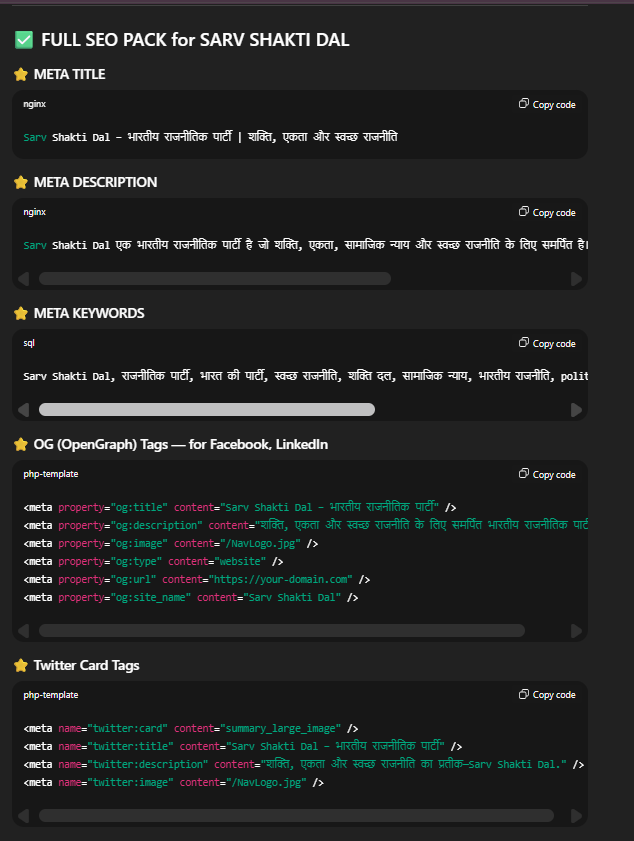
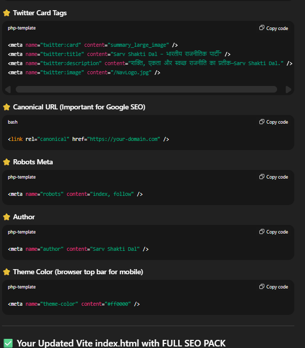

# 🚀 Sarvashakti Dal - Official Website

**सर्वशक्ति दल: समाज सेवा और सशक्तिकरण**

A modern, responsive website for Sarvashakti Dal organization built with React, Vite, and Tailwind CSS featuring stunning gradient animations and smooth user experience.




---

## 📋 Table of Contents
- [About](#about)
- [Features](#features)
- [Tech Stack](#tech-stack)
- [Installation](#installation)
- [Usage](#usage)
- [Project Structure](#project-structure)
- [Deployment](#deployment)
- [Contributing](#contributing)

---

## 🎯 About

Sarvashakti Dal is a social service organization dedicated to bringing positive change in society through education, health, and women empowerment. This website serves as the digital presence for the organization, providing information about:

- Membership registration
- Social initiatives and programs
- Community engagement
- News and updates
- Contact and donation facilities

---

## ✨ Features

### 🎨 Modern UI/UX
- **Trending Gradient Colors**: 8 unique gradient color schemes (purple-violet, pink-red, blue-cyan, green-teal)
- **Smooth Animations**: Fade-in, scale-in, slide animations with staggered delays
- **Hover Effects**: Interactive lift effects on cards and images
- **Responsive Design**: Mobile-first approach, works on all devices

### 🚀 Performance
- **Lazy Loading**: Components and images load on demand
- **Code Splitting**: Optimized bundle size (308KB JS, 26KB CSS gzipped)
- **Fast Refresh**: Instant HMR during development
- **SEO Optimized**: Semantic HTML, proper meta tags, accessibility features

### 📱 Pages
- **Home**: Hero carousel, feature cards, gallery, news section
- **About**: Organization information
- **Join**: Membership registration
- **Donate**: Donation portal
- **Gallery**: Photo gallery
- **News**: Latest updates and blogs
- **Contact**: Contact form and information

---

## 🛠️ Tech Stack

### Frontend
- **React 19.2.0** - UI library
- **Vite 7.2.4** - Build tool and dev server
- **Tailwind CSS 4.1.17** - Utility-first CSS framework
- **React Router DOM 7.9.6** - Client-side routing

### Additional Libraries
- **Lucide React** - Icon library
- **React Icons** - Additional icons
- **React Bootstrap** - UI components

### Development Tools
- **ESLint** - Code linting
- **@vitejs/plugin-react** - Fast Refresh support

---

## 📦 Installation

### Prerequisites
- Node.js (v16 or higher)
- npm or yarn

### Steps

1. **Clone the repository**
```bash
git clone <repository-url>
cd SarvShaktiDal
```

2. **Install dependencies**
```bash
npm install
```

3. **Start development server**
```bash
npm run dev
```

4. **Open browser**
```
http://localhost:5173
```

---

## 🎮 Usage

### Development
```bash
npm run dev          # Start dev server
npm run build        # Build for production
npm run preview      # Preview production build
npm run lint         # Run ESLint
```

### Environment
The project runs on:
- **Dev Server**: `http://localhost:5173`
- **Build Output**: `dist/` folder

---

## 📁 Project Structure

```
SarvShaktiDal/
├── public/                 # Static assets
│   ├── flag.webp
│   ├── logo.png
│   ├── NavLogo.webp
│   ├── sliderImg1.webp
│   └── sliderImg2.webp
├── src/
│   ├── components/        # Reusable components
│   │   ├── Footer.jsx
│   │   ├── FormContact.jsx
│   │   ├── Heading.jsx
│   │   ├── HeroCarousel.jsx
│   │   └── Navbar.jsx
│   ├── pages/            # Page components
│   │   ├── About.jsx
│   │   ├── Contact.jsx
│   │   ├── Donate.jsx
│   │   ├── Gallery.jsx
│   │   ├── Home.jsx
│   │   ├── Join.jsx
│   │   └── News.jsx
│   ├── App.jsx           # Main app component
│   ├── main.jsx          # Entry point
│   └── index.css         # Global styles & animations
├── .gitignore
├── eslint.config.js
├── index.html
├── netlify.toml          # Netlify config
├── vercel.json           # Vercel config
├── package.json
├── vite.config.js
└── README.md
```

---

## 🎨 Key Features Implementation

### Gradient Animations
```css
/* 8 unique gradient classes */
.card-gradient-1 { background: linear-gradient(135deg, #667eea 0%, #764ba2 100%); }
.card-gradient-2 { background: linear-gradient(135deg, #f093fb 0%, #f5576c 100%); }
/* ... and 6 more */
```

### Animation Keyframes
- `fadeInUp` - Elements fade in from bottom
- `scaleIn` - Elements scale from 90% to 100%
- `slideInLeft/Right` - Horizontal slide animations
- `gradientShift` - Animated gradient backgrounds

### Performance Optimizations
- Lazy loading with React.lazy()
- useMemo for stable component identity
- Image optimization (WebP format, lazy loading)
- Code splitting by route

---

## 🚀 Deployment

### Option 1: Vercel (Recommended)
```bash
npm i -g vercel
vercel
```

### Option 2: Netlify
```bash
npm i -g netlify-cli
netlify deploy --prod
```

### Option 3: GitHub Pages
```bash
npm install --save-dev gh-pages
npm run deploy
```

### Build Output
- Production files: `dist/` folder
- Bundle size: ~308KB JS (gzipped: 98KB)
- CSS size: ~26KB (gzipped: 5.7KB)

---

## 🎯 Browser Support

- Chrome (latest)
- Firefox (latest)
- Safari (latest)
- Edge (latest)
- Mobile browsers

---

## 📝 License

This project is created for Sarvashakti Dal organization.

---

## 👥 Contributing

Contributions are welcome! Please follow these steps:

1. Fork the repository
2. Create a feature branch (`git checkout -b feature/AmazingFeature`)
3. Commit changes (`git commit -m 'Add AmazingFeature'`)
4. Push to branch (`git push origin feature/AmazingFeature`)
5. Open a Pull Request

---

## 📞 Contact

For any queries regarding the website or organization:
- Visit: [Contact Page](#)
- Organization: Sarvashakti Dal

---

## 🙏 Acknowledgments

- React Team for the amazing library
- Vite Team for the blazing fast build tool
- Tailwind CSS for the utility-first framework
- All contributors and supporters of Sarvashakti Dal

---

**Made with ❤️ for Sarvashakti Dal**


